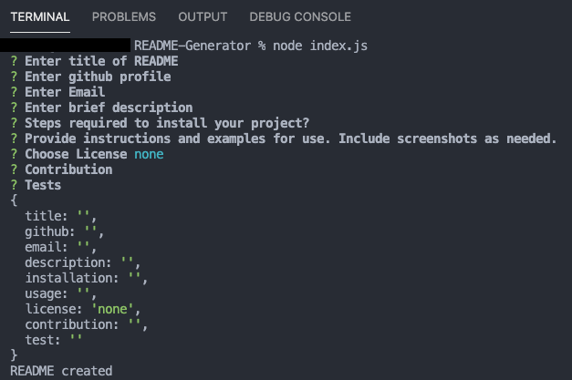

# README-Generator
CLI README Generator

## Table of Contents
* [Introduction](#introduction) 
* [How it Works](#how-it-works)
* [Requirements](#requirements)
* [Demo Images](#demo-images)
* [Contact](#contact)
* [Links](#links)

## Introduction
A CLI application that creates a quick and easy README for your project

## How it Works
By opening up your terminal and running 'node index.js' you'll have questions that'll 
need to be filled to create your README.md  

## Requirements
CLI

## Demo Images

 

## Contact
If you want to contact me you can reach me at 5205bda@gmail.com.

## Links
[Github](https://github.com/banda-adrian)
